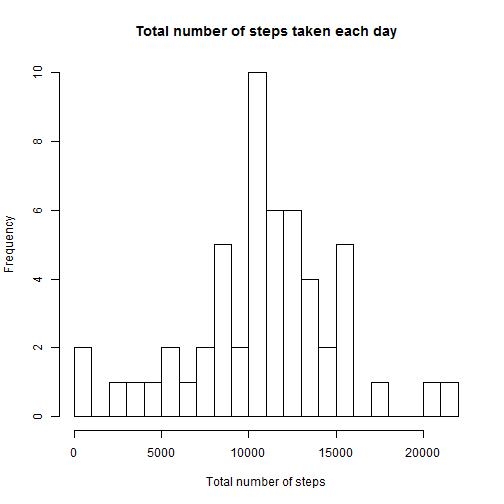
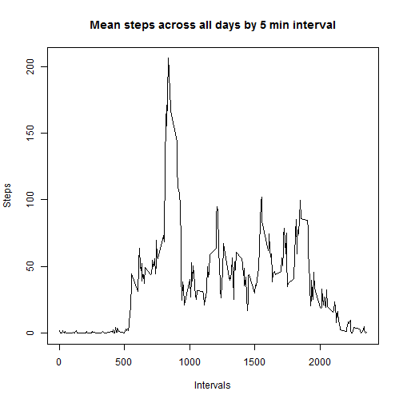
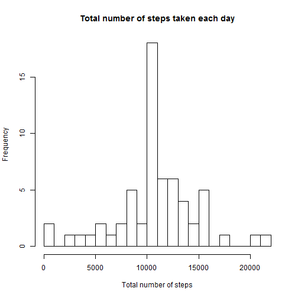

###Loading and preprocessing the data


```r
ds <- read.csv("activity.csv")
empty<-is.na(ds$step)

sds <- ds[!empty,]
sds$date <- factor(sds$date)
```


###Mean total number of steps taken per day


```r
stepsdate <- aggregate(sds$steps, 
                         list(date = sds$date), sum)
colnames(stepsdate) <- c("date", "steps")
hist(stepsdate$steps, xlab="Total number of steps", main = "Total number of steps taken each day", breaks = 20)
```

 


The mean total number of steps taken per day 

```r
mean(stepsdate$steps)
```

```
## [1] 10766
```
The median total number of steps taken per day 

```r
median(stepsdate$steps)
```

```
## [1] 10765
```

###The average daily activity pattern

```r
stepsint <- aggregate(sds$steps, 
                         list(interval = sds$interval), mean)
colnames(stepsint) <- c("interval", "steps")
plot(stepsint$interval, stepsint$steps, type = "l", xlab="Intervals", ylab="Steps", main="Mean steps across all days by 5 min interval")
```

 

```r
stepsint[stepsint[,"steps"] == max(stepsint$steps),]
```

```
##     interval steps
## 104      835 206.2
```
5-minute interval, on average across all the days in the dataset, contains the maximum number of steps

###Imputing missing values
Total number of missing values in the dataset is

```r
summary(ds$steps)["NA's"]
```

```
## NA's 
## 2304
```
Filling in all of the missing values in the dataset using the mean for that 5-minute interval

```r
dsmean <- aggregate(sds$steps, 
                         list(interval = sds$interval), mean)
names(dsmean) <- c("interval", "steps")
fullds <- ds

f <- function(x) {
    if (is.na(x[2])) {
        dsmean[dsmean[,"interval"] == x[1], "steps"]
    } else {
        x[2]
    }
}

xt <- apply(fullds[,c("interval", "steps")], 1, f)
fullds[,"steps"] <- xt
```

Repeat steps from "Mean total number of steps taken per day" section

```r
stdate <- aggregate(fullds$steps, 
                         list(date = fullds$date), sum)
colnames(stdate) <- c("date", "steps")
hist(stdate$steps, xlab="Total number of steps", main = "Total number of steps taken each day", breaks = 20)
```

 


The mean total number of steps taken per day 

```r
mean(stdate$steps)
```

```
## [1] 10766
```
The median total number of steps taken per day 

```r
median(stdate$steps)
```

```
## [1] 10766
```
As we can see mean and median values almost haven't been changed, because we used interval mean values for imputting missing values. 

We can see that frequency of the total step values increases, which simply means increasing of values overall

###Differences in activity patterns between weekdays and weekends


```r
weekday <- weekdays(as.Date(fullds$date, format="%Y-%m-%d"))
wd <- weekday == "суббота" | weekday == "воскресенье"
fullds$weekday <- ""
fullds[wd,"weekday"] <- "weekend"
fullds[!wd,"weekday"] <- "weekday"
fullds$weekday <- factor(fullds$weekday)

stwd <- aggregate(fullds$steps, 
                         list(weekday = fullds$weekday
                              , interval = fullds$interval), mean)
colnames(stwd) <- c("weekday", "interval", "steps")
library(lattice)
xyplot(stwd$steps ~ stwd$interval | stwd$weekday, 
       layout = c(1,2), pch=19, type ="l",
       xlab = "Interval", ylab = "Steps")
```

 
